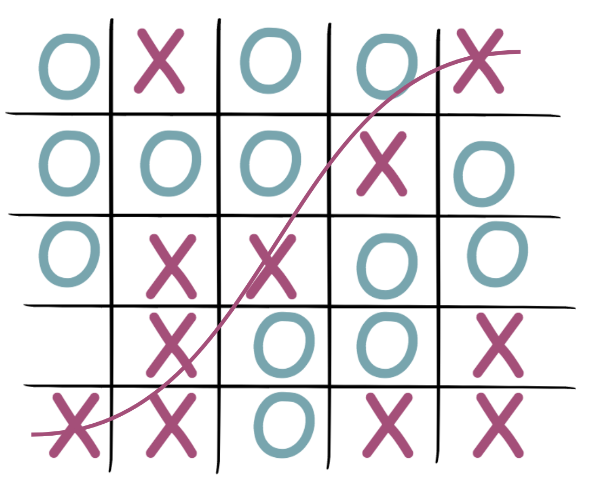

# Tic Tac Toe 
This web-development game is a  project for [SEI](https://generalassemb.ly/) course at [Misk academy](https://misk.org.sa/miskacademy/) 
* [Play the game here](https://ahlamcpp.github.io/TicTacToe/index1.html) :checkered_flag:

## How To Play: 
The goal of this project is to make it possible for users to have a richer experience when playing TicTacToe. 
How? There are three levels: **Easy**, **Medium** and **Advanced** levels . 

### Easy Level: 3X3 grid :open_mouth:

When you play on a three by three game board, your goal is to win by getting three in a row - either across, down, or diagonally :clap: 
In case of getting a full grid without a winner, it's a Tie.. so try again! :v: 
The first player will be **X** and the second is **O**.
There is a countdown timer with only **30** seconds, so you need to finish the game within **30** seconds :exclamation:

### Medium Level: 4X4 grid :anguished:

Here, it's the same but with a 4x4 board, so your goal is to win by getting four in a row - either across, down, or diagonally :clap: 
There is a countdown timer with only **40** seconds :exclamation:

### Advanced Level: 5X5 grid :astonished:

Here, it's the same but with a 5x5 board, so your goal is to win by getting five in a row - either across, down, or diagonally :clap: 
There is a countdown timer with only **60** seconds :exclamation:

## Game over:
Once the game has a winner or there is a Tie, you will see a dialog informing about the result. From here you can:

1. Repeat the game.
2. Start a new game.
3. Go to more advanced level.

## Main Technologies:
* [JavaScript](https://www.javascript.com/)
* [jQuery](https://jquery.com/)
* [HTML](https://www.w3schools.com/html/)
* [CSS](https://www.w3schools.com/css/)

## Some Features:
* User could keep track of multiple game rounds with a win, lose and tie counter.
* The game site is fully responsive so that it is playable from a mobile phone.
* Unlimited countdown timer.
* A user could moves between levels.
* The game Involves Baby sharks song.

### Wireframe:

## :soon: Future Improvements:
- [&#x2713;] Player Vs Computer game.
- [&#x2713;] Player able to choose between X or O. 
- [&#x2713;] A countdown timer with user input along with pause button.

### Pop-Up:
- https://sweetalert2.github.io/  
- https://sweetalert.js.org/docs/#icon

### Markdown README File
* https://guides.github.com/features/mastering-markdown/
* https://help.github.com/en/articles/basic-writing-and-formatting-syntax#using-emoji

### Background Music: :microphone:
* [Baby Shark (Trap Remix)](https://www.youtube.com/watch?v=KybAvaM3b90)
